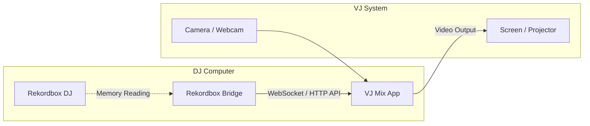
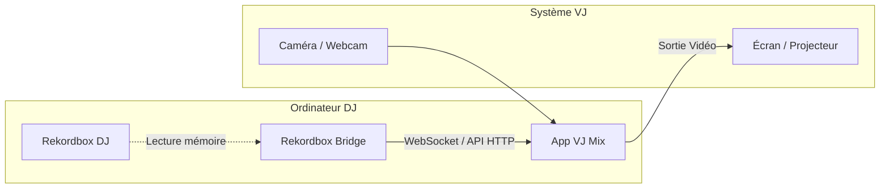

# VJ Mix - downloads

> 🇬🇧 **English** — 🇫🇷 la version française de ce document est disponible plus
> bas : **[aller à la version française](#version-française)**.

A VJing (Visual Jockey) application designed to manage videos, generate dynamic and reactive visuals, and overlay live camera capture.

This repository holds **only the published binaries and the release notes**.

  

## Features

- **Multimedia Sources**: Import and use your own videos, images, and custom visuals to enrich the scene.
- **Live Camera Capture**: Integrate the video feed from your webcam or an external camera in real-time during your performances.
- **Background Removal**: Automatically remove the background from your video capture to transparently overlay the artist on top of the visuals.
- **Graphic Effects**: Apply various visual effects (filters, color grading, distortions) independently on the different sources (videos, camera, animations).
- **Custom Texts**: Add, configure, and synchronize animated texts on the fly.

## Operation Modes

The application offers two main modes of operation to suit your setup:

### 1. Standard Mode (Standalone)
In this mode, VJ Mix runs completely autonomously. Visuals can be animated manually or react dynamically to the audio captured by the browser's microphone or system audio routing. 
It is the perfect mode for quick and simple usage without requiring any third-party DJ software.

### 2. Rekordbox Bridge Mode (Advanced)
This advanced mode perfectly synchronizes your visuals with your DJ set in real-time. The VJ Mix application connects to the **Rekordbox Bridge** API, a local gateway that communicates directly with your Rekordbox DJ software.

In this mode, VJ Mix receives frame-perfect, real-time data:
- The exact BPM and playback position
- Millimeter-precise beat grid synchronization
- Track structure and phrasing (intro, verse, chorus, build-up, drop, outro...)
- Active deck and playback states

This data is used to automatically trigger visual effects, transitions, and animations that strictly follow the musical dynamics and structure of your mix.

#### Architecture with Rekordbox Bridge

> **Note:** The **Rekordbox Bridge** software is required for this mode and must run alongside Rekordbox. You can download it from the [Rekordbox Bridge Releases repository](https://github.com/eric-bastian/rekordbox-bridge-releases).

## Download

➡️ **[Download VJ Mix (Alpha Version)](https://github.com/eric-bastian/vj-mix-releases/raw/main/VJMIX_Setup.exe)**

Windows 10 / 11, 64-bit.

The executable is **not digitally signed**: Windows SmartScreen will show a
warning on first launch ("More info" → "Run anyway").

## Requirements

- Windows 10 or 11, 64-bit

## Warning

**Experimental** software, provided "as is", **without any warranty** of
operation, stability or accuracy, including during a live performance.
**The user assumes the entirety of the risks.**

---

# VJ Mix - téléchargements

Une application de VJing (Visual Jockey) conçue pour gérer des vidéos, générer des visuels dynamiques et réactifs, et incruster une capture caméra en live.

Ce dépôt contient **uniquement les exécutables publiés et les notes de version**.

  

## Fonctionnalités

- **Sources Multimédias** : Importez et utilisez vos propres vidéos, images et visuels personnalisés pour enrichir la scène.
- **Capture Caméra en Live** : Intégrez le flux vidéo de votre webcam ou d'une caméra externe en temps réel pendant vos performances.
- **Détourage (Background Removal)** : Supprimez automatiquement l'arrière-plan de votre capture vidéo pour incruster l'artiste de manière transparente par-dessus les visuels.
- **Effets Graphiques** : Appliquez de nombreux effets visuels (filtres, colorimétrie, déformations) de manière indépendante sur les différentes sources (vidéos, caméra, animations).
- **Textes Personnalisés** : Ajoutez, paramétrez et synchronisez des textes animés à la volée.

## Modes de fonctionnement

L'application propose deux modes de fonctionnement principaux pour s'adapter à vos besoins :

### 1. Mode Standard (Autonome)
Le mode standard permet d'utiliser l'application de manière totalement autonome. Les visuels réagissent de manière indépendante ou à l'aide de l'analyse audio du navigateur (micro ou mixage stéréo du système) pour animer les différents effets graphiques. 
C'est le mode idéal pour une utilisation simple et rapide, sans avoir besoin d'un logiciel DJ tiers.

### 2. Mode Rekordbox Bridge (Avancé)
Ce mode avancé permet de synchroniser parfaitement les visuels avec votre set DJ en temps réel. L'application VJ Mix se connecte à l'API **Rekordbox Bridge**, une passerelle locale qui communique directement avec votre logiciel Rekordbox.

Dans ce mode, l'application reçoit en temps réel :
- Le BPM exact et la position de lecture
- La synchronisation millimétrée des *beats* (mesures)
- La structure du morceau en cours (phrases : intro, drop, chorus, outro, etc.)
- L'état de lecture et la platine active (Deck)

Ces données permettent de déclencher automatiquement des effets visuels, des animations et des transitions qui collent parfaitement à la dynamique musicale et à la structure de votre mix.

#### Architecture avec Rekordbox Bridge

> **Note :** Le logiciel **Rekordbox Bridge** est requis pour utiliser ce mode et doit s'exécuter en même temps que Rekordbox. Il peut être téléchargé gratuitement depuis le dépôt [Rekordbox Bridge Releases](https://github.com/eric-bastian/rekordbox-bridge-releases).

## Téléchargement

➡️ **[Télécharger VJ Mix (Version Alpha)](https://github.com/eric-bastian/vj-mix-releases/raw/main/VJMIX_Setup.exe)**

Windows 10 / 11, 64 bits.

L'exécutable n'est **pas signé numériquement** : Windows SmartScreen affichera un
avertissement au premier lancement ("Informations complémentaires" → "Exécuter quand même").

## Prérequis

- Windows 10 ou 11, 64 bits

## Avertissement

Logiciel **expérimental**, fourni "tel quel", **sans aucune garantie** de
fonctionnement, de stabilité ou d'exactitude, y compris lors d'une performance en direct.
**L'utilisateur assume l'intégralité des risques.**
